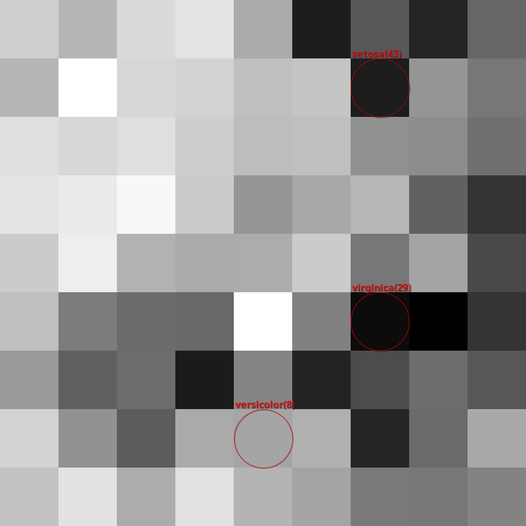
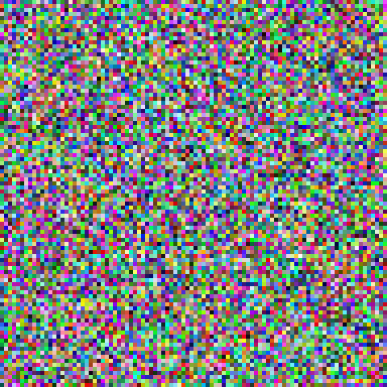
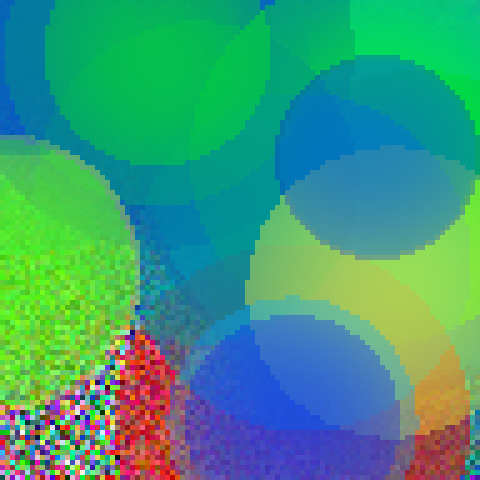

# clj-som

A Clojure library for Self Organizing Maps (aka Kohonen networks).

## Self Organizing Maps (SOM) / Kohonen networks
A SOM is an unsupervised machine learning technique for dimensionality reduction. The typical usecase is representing a multidimensional dataset as clusters in a two dimensional plane.

## Implementation details
A set of vectors are used as input data.

Vector distance can be calculated using any function. Implementations for Euclidean (default) and Manhattan distance are included, and should work for the vast majority of use cases.

Results can be stored in a Unified Distance Matrix (uMatrix).

## Usage
The code in the tests provide a good starting point on how to use the library. Running `lein test` will train one random SOM on the well-known 1936 Iris dataset by R. Fisher, and another SOM on a randomized color dataset.

### Iris test
The iris test will produce a u-matrix with labels on the most common cell for each test vector to end up in:

### Color test
The color test is similar to the Iris test, but since we're talking about ARGB color vectors, we can easily write color images to inspect the data. Here's a snippet of code that first produces a quasi random dataset, and then runs 20 epochs of training on it:

	(def color-dataset
	  (->
	   (reduce
	    (fn [data _]
	      (cons
	       (let [r (rand 8)]
	         (cond
	           ;; Red-ish
	           (> r 7)
	           [(+ 0.98 (rand 0.02)) (rand 0.04) (rand 0.04)]
	           ;; Blue-ish
	           (> r 5)
	           [(rand 0.04) (rand 0.04) (+ 0.51 (rand 0.02))]
	           ;; Orange-ish
	           (> r 6)
	           [(+ 0.98 (rand 0.02)) (+ 0.39 (rand 0.02)) (+ 0.24 (rand 0.02))]
	           ;; Light blue-ish
	           (> r 4)
	           [(rand 0.04) (rand 0.04) (+ 0.98 (rand 0.02))]
	           ;; Green-ish
	           (> r 3)
	           [(rand 0.01) (+ 0.5 (rand 0.2)) (+ 0.25 (rand 1))]
	           ;; Light green-ish
	           (> r 2)
	           [(rand 0.04) (+ 0.98 (rand 0.02)) (rand 0.04)]
	           ;; Yellow-ish
	           (> r 1)
	           [(+ 0.988 (rand 0.012)) (+ 0.98 (rand 0.02)) (+ 0.19 (rand 0.02))]
	           ;; Purple-ish
	           (> r 0)
	           [(+ 0.988 (rand 0.012)) (rand 0.01) (+ 0.988 (rand 0.012))]))
	       data))
	    nil
	    (range 20))
	   identity))

	;; Helper function to put vectors as colors into a PNG image
	(defn display-colors [som filename]
	  (let [nodes (:nodes som)
	        width (alength nodes)
	        scale 5
	        height (alength (aget nodes 0))
	        bi (java.awt.image.BufferedImage.
	            (* width scale) (* height scale)
	             java.awt.image.BufferedImage/TYPE_INT_ARGB)
	        g (.createGraphics bi)
	        clamp (fn [v]  (cond (< v 0) (do 0.0)
	                             (> v 1) 1.0
	                             true v))]
	    (.setRenderingHint g java.awt.RenderingHints/KEY_ANTIALIASING
	                       java.awt.RenderingHints/VALUE_ANTIALIAS_ON)
	    ;; Draw vectors as colors
	    (reduce (fn [_ x]
	              (reduce (fn [_ y]
	                        (let [w (aget nodes x y)]
	                          (.setColor g
	                                     (new java.awt.Color
	                                          (double (clamp (aget w 0)))
	                                          (double (clamp (aget w 1)))
	                                          (double (clamp (aget w 2)))))
	                          (.fillRect g (* x scale)
	                                     (- (* height scale) (* (inc y) scale))
	                                     scale scale)))
	                      nil (range height)))
	            nil (range width))
	    (javax.imageio.ImageIO/write bi "png" (java.io.File. filename))))

	(deftest test-train-colors
	    (let [color-sample (fn []
	                         (into-array Double/TYPE
	                                     (nth color-dataset
	                                          (rand (count color-dataset)))))
	          input-vec-gen (fn [] (double-array
	                                [(rand)(rand)(rand)]))
	          ;; Dim roughly = 5 * sqrt num-samples
	          som (make-som 3 96 96 input-vec-gen)
	          trained-som (train som color-sample 20)
	          um (u-matrix trained-som euclidean-dist)]
	      (display-colors som "colors.png")
	      (display-colors trained-som "colors-trained.png")
	      (export-u-matrix um "colors-trained-um.png" 5)))

Results:

Random color dataset                   | After 20 epochs of training
:-------------------------------------:|:----------------------------------------------:
 | 
